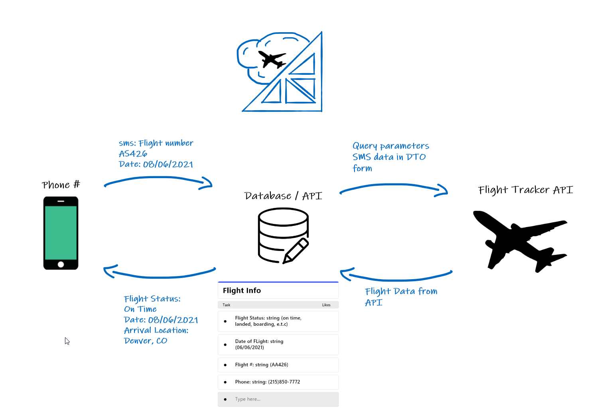

# Azure Skies

> The SMS flight tracker that keeps you updated with your desired flight's status in real time.

By: Jona Brown, Benjamin Ibarra, Joel Connell

## Table of Contents

* [General Info](#general-information)
* [Technologies Used](#technologies-used)
* [Features](#features)
* [Media](#media)
* [Table Explanation](#table-explanation)
* [Setup](#setup)
* [Usage](#usage)
* [Project Status](#project-status)
* [Room for Improvement](#room-for-improvement)
* [Acknowledgements](#acknowledgements)
* [Contact](#contact)
* [License](#license)

## General Information
1. Summary of idea.

Flight Tracker API - Azure Skies.

Track a flight by Texting the flight's icao number to Azure Skies. Aftering texting a valid flight icao number, you will be Subscribed to Azure Skies flight status notification service for the duration of the flight. You will receive automated text messages whenever your flight's status changes from active to "landed", or "cancelled".

2. What problem or pain point does it solve?

If you have ever wanted to keep track of when a flight is boarding, taking off and landing without needing to visit any website or constantly open an app? Azure skies will be able to send you automated text messages based on flight status. This means you will always be able to stay up to date without the click of a button, no matter which airline you (or they) are traveling with.

3. Minimum Viable Product (MVP) definition?

Text your flight number icao to Azure Skies, receive an immediate status of the flight, and be subscribed to Azure Skies notifications for the duration of the flight.

## Technologies Used

* C# 9.0
* .Net 5
* Entity Framework
* [AviationStack APi](https://aviationstack.com/documentation)
* [Azure](https://azure.microsoft.com/en-us/features/azure-portal/)
* [Insomnia](https://insomnia.rest/)
* [ngrok](https://ngrok.com/)

## Architecture

## Usage
Open source project that utilizes APIs in a meaningful way to communicate data. Specifically automated flight status messages from API to user, cutting out the need to log into an app, scour for an e-mail for flight details, or logging into a website. Straight to user automated flight notifications.

## Project Status

### Day One: 
- Acquired AviationStack API Key
- Established Azure Account, ResourceGroup, and Azure communications account along with a phone number to handle outbound and inbound messages
- Created the Azure Skies principal web app
- Preliminary Models, interfaces, DTO's, and Services created
- implemented Azure.Communications & Azure.Communications.SMS allowing to send our first message from out web app

### Day Two:
- Established proper AviationStack API requests from Web App
- Refined Models, Interfaces, DTO's, and Services
- Created Controllers and established HTTP endpoints
- Created preliminary Azure Function trigger to ping the AviationStack Api and update our local database of tracked flights
- Added Azure EventGrids to our Azure communications Service
- Deep dive into Azure EventGrid and Webhook documents

### Day Three:
- Finalized Azure function trigger
- Finalized Models, Schemas, DTO's
- Determined services and controller logic between taking in Text message response from EventGrid
- Determined services and controller logic to create models, DTO's, and send messages back to user

### Day Four:
- Finally establish proper custom HTTP endpoints for Azure Evengrid and Webhook to receive Text message data from users
- Used ngrok and insomnia to test and debug webhook validation and handshake
- Successfully validated Webhook handshake, and started making proper use of EventGrid responses
- SMS inbound messages can now be parsed and used to query AviationStack and respond to user with flight status notifications
- Database Logic was established to filter through and ping for updates only for flights with in Azure Skies database
- Reached MVP, Azure Skies deployed and working

## Room for Improvement

- Automated time until flight arrival messages

## Acknowledgements
John Cokos  
Edward Younskevicius  
Kjell Overholt  

## Contact
Feel free to access us across these fine hotlinks -  
Jona Brown - [https://www.linkedin.com/in/jona-brown-a50946175/](https://www.linkedin.com/in/jona-brown-a50946175/)  
Benjamin Ibarra - [https://www.linkedin.com/in/ibarraben/](https://www.linkedin.com/in/ibarraben/)  
Joel Connell - [https://www.linkedin.com/in/joel-connell-6a8757210/](https://www.linkedin.com/in/joel-connell-6a8757210/)  

## License

This project is open source and available under the [MIT License](./LICENSE).
